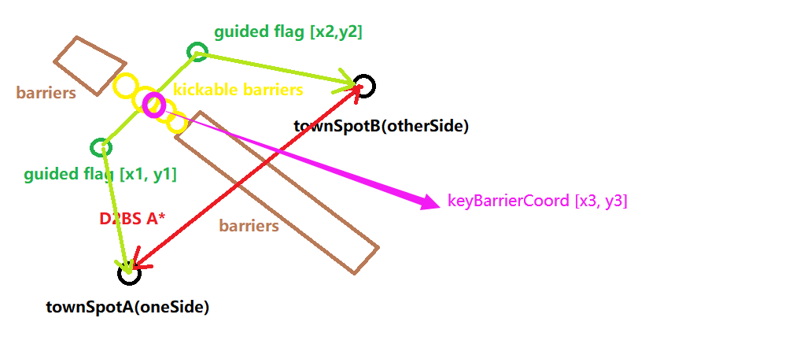

kolbot private server
===

## An extended script library based on kolbot for D2 private server

## Q&A

**1.Why do we need this?**

Main reason is that A* path generated from D2BS is wrong because there are types of object unit assigned by customized
town map(ds1) in private servers. To solve the issue, I make the bot to distinguish town map with townModes(barrier
units distribution types) saved by my tools, and **easily config** to add some flags(spots) which can be reached via
D2BS A* path between town spots.

**2.How to save townModes?**

Use D2BotMapPrivateServer.dbj as the entry script.  
Hotkeys: 
F1 - add barrier units around the character 
F2 - save townMode based on barrier units you added before 
F3 - check townMode from saved townModes(data/townModes.json) based on barrier units added before 
F4 - remove the last townMode added in current town 
F5 - show coords/NPC/object/cursorItem information 
F6 - find a new room(game) that barrier units around **Born Point** don't match any townModes saved before

**3.How to config to guide the bot use flags between town spots?**

Please **check the example** in file(**private-server/config/townConfig.js**). The image below should be helpful as
well. 

**4.How do the functions deal with breakable barriers?**

It checks breakable barriers around the character every time the character walks in town and makes the character kick
breakable barriers next to keyBarrierCoords. Repeat barriers(stacking at one point) will be ignored.

**5.NPC/portalspot spots are changed in my private server. What can I do?**

You can also configure it in townConfig.js. To reset or add spot for all townModes, use **actx.extraSpots**. To reset or
add spot for given townMode, use **townModex.resetSpots**. The bot will also reset unconfigured townSpots **once** by
getting the units except portalspot since portalspot might change many times. If you want to add extra portalspot, the
townSpot name must include **"portalspot"**.

**6.Demo video?**

I will do it... one day? xD

## Main files

### 1.private-server/tools/TownModeHelper.js

A tool thread for saving barrier object units and show information used for configuration.

### 2.private-server/config/townConfig.js

A configuration file to add townMode path flags.

### 3.private-server/config/TownOverrides.js

Specific overrided functions for private server.

### 4.private-server/config/PatherOverrides.js

Specific overrided functions for private server.

### 5.private-server/includes/OOGOverrides.js

Added a function to **change realm at character select location**.

### 6.private-server/includes/AutoMuleOverrides.js

Overrided AutoMule for muling in a given realm.

### 7.private-server/data/townModes.json

Json file for saving townModes.
